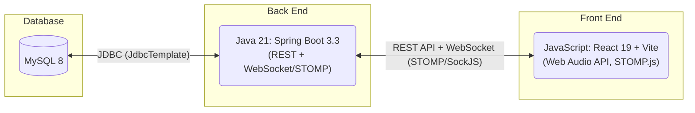
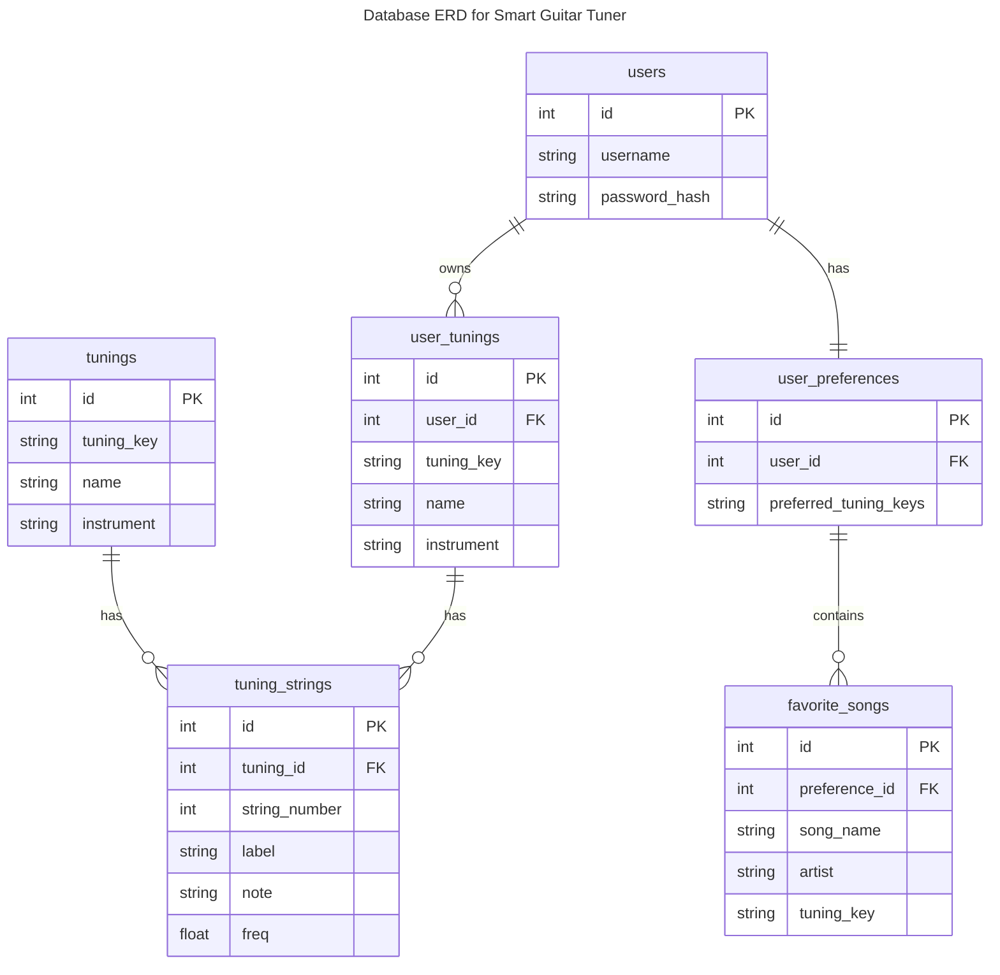
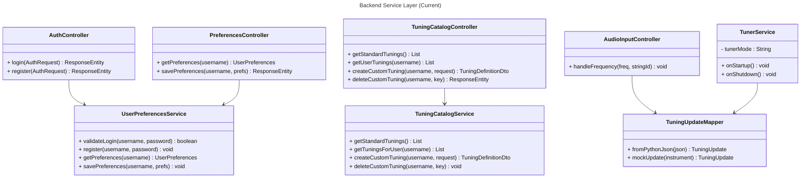
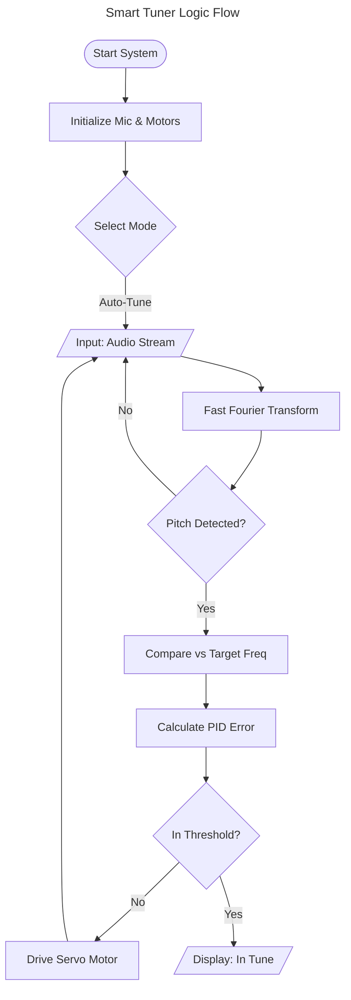
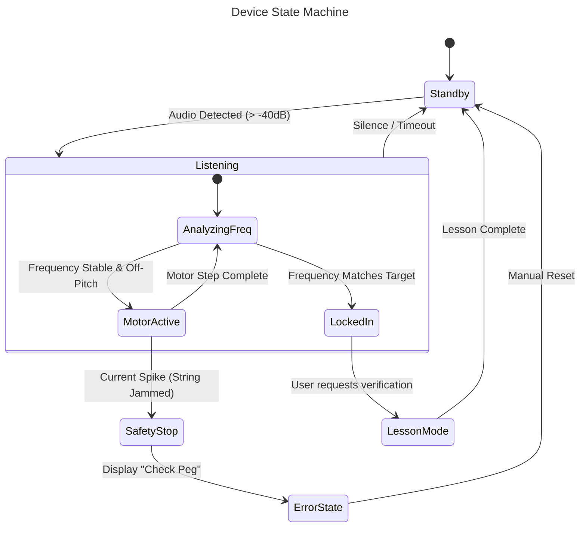

# Specification Document

Please fill out this document to reflect your team's project. This is a living document and will need to be updated regularly. You may also remove any section to its own document (e.g. a separate standards and conventions document), however you must keep the header and provide a link to that other document under the header.

Also, be sure to check out the Wiki for information on how to maintain your team's requirements.

## TeamName

TuneDevs

### Project Abstract

<!--A one paragraph summary of what the software will do.-->

The primary objective of our project is to create a small form factor device that allows guitarists to tune their instruments in a studio setting, all the way to noisy bars. This handheld device will use real time information to auto-tune the instrument via a contact microphone, so that the tuner works in many environments.

Please view this file's source to see `<!--comments-->` with guidance on how you might use the different sections of this document. 

### Customer

Our customers will be musicians that appreciate the convenience of being able to make these tunings on the fly. Many established musicians "tune by ear", but the addition of multiple profiles to be able to instantaneously tune depending on the song will make the musician more efficient, and be able to focus more on the art they are presenting.

### Specification

<!--A detailed specification of the system. UML, or other diagrams, such as finite automata, or other appropriate specification formalisms, are encouraged over natural language.-->

<!--Include sections, for example, illustrating the database architecture (with, for example, an ERD).-->

<!--Included below are some sample diagrams, including some example tech stack diagrams.-->

#### Technology Stack

#### Database

#### Class Diagram

#### Flowchart

#### Behavior

### Standards & Conventions

<!--This is a link to a seperate coding conventions document / style guide-->
[Style Guide & Conventions](STYLE.md)
